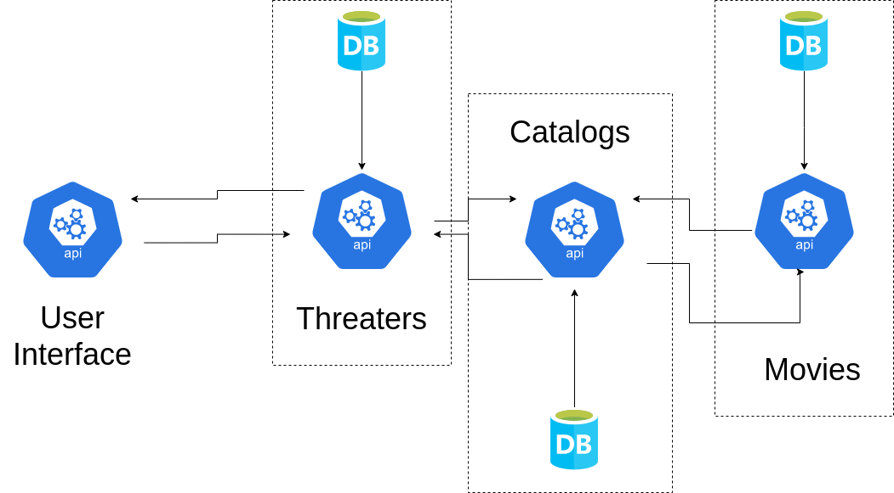

# DOJO microservice-TDD-node


Objetivo deste dojo, é desenvolver a pratica TDD, utilizando uma arquitetura de microserviços.

# Tecnologias

* [Express](https://expressjs.com/) - Framework server
* [Node](https://nodejs.org/en/) - Runtime builder
* [Jest](https://jestjs.io/) - Framework testing

***
# Configurações

Inicialmente para que seja possivel praticar, copie o template disponibilizado no repositorio "[service-template](./service-template)" e renomeie com o nome do serviço desejado.

***
# Serviços
## Movie

### Schema
``` javascript
const movie = {
   title: string,
   overview: string,
   runtime: integer,
   releaseDate: isoDate,
   images: string,
   genres: [string]
}
```
### Endpoints

* **GET** => /movies
* **GET** => /movies/:id
* **GET** => /movies/:premiers
* **POST** => /movies
* **PUT** => /movies
* **DELETE** => /movies

***
## Catalog

### Schema

```javascript
const catalog = {
   theater: ObjectId
   createdAt: isoDate,
   expirateDate: isoDate,
   status: bool,
   movies: [movie]
}
```

### Endpoints

* **GET** => /catalogs/theaters/:threaterId ( buscar filmes do catalogo )
* **POST** => /catalogs/movies ( Adicionar um filme ao catalogo )
* **POST** => /catalogs/status/:status (Mudar status, de pendente para ativo) 
* **DELETE**  => /catalogs/movies ( Remove um filme do catalogo )

***
## Theaters

### Schema
```javascript

const threater = {
   companyName: string,
   address: string,
   city: string,
   rooms: [{
       number: string,
       capacity: number
   }]
}
```

### Endpoints

* **GET** => /threaters (Criar filtros para companyName, address, city)
* **GET** => /threaters/:id
* **GET** => /threaters/rooms


# Arquitetura
